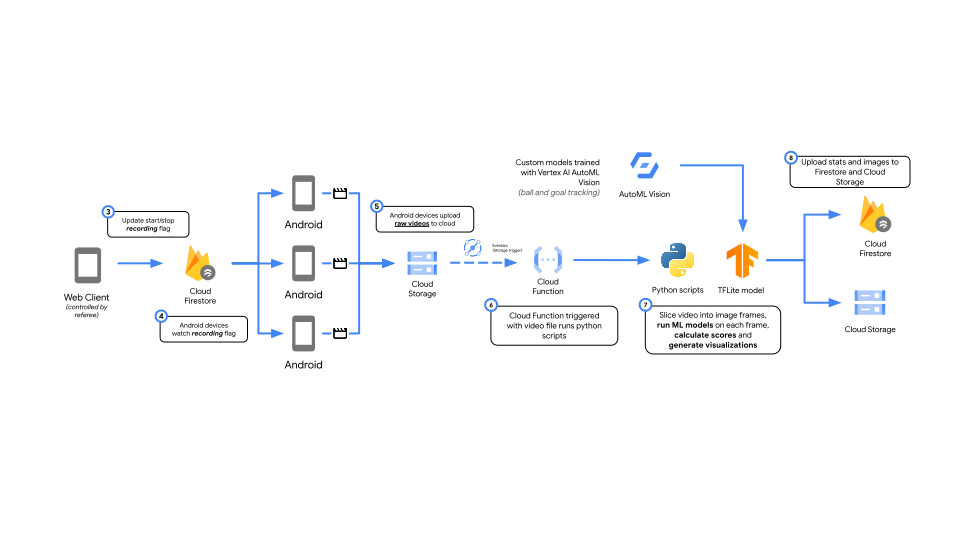

# ai-penalty-challenge

This repository contains the codebase for the APSX AI sports video analyser. The APSX platform uses Google Cloud's serverless products such as Cloud Functions, Cloud Storage, and Firestore to create a scalable and cost-effective video processing pipeline. 

This code is written in Python and leverages various libraries, including:

* **TensorFlow:** For object detection and player segmentation using pre-trained TensorFlow Lite models.
* **OpenCV:** For video processing tasks like frame extraction, resizing, and color conversion.
* **Firebase Admin SDK:** To interact with Firestore for managing data related to events, actions, and user data.
* **Google Cloud Storage:** For storing uploaded videos, processed frames, and generated analysis plots. 
* **Vertex AI Generative AI:** For generating style score and background images using multimodel Gemini Pro and Imagen2 models.

## Overview

The APSX platform relies on an event-driven architecture, where new videos uploaded to Google Cloud Storage trigger the analysis pipeline. The process broadly includes:

1. **Video Upload:** Users upload videos to a designated Google Cloud Storage bucket.
2. **Event Trigger:** New file uploads trigger a Cloud Function. 
3. **Data Extraction:** The function parses video metadata (event ID, session ID, action ID, camera ID) from the filename.
4. **Firestore Updates:**  The function updates Firestore with details of the new video.
5. **Analysis Initiation:** The function identifies processing configurations for the specific camera and initiates analysis by invoking other specialized Cloud Functions.
6. **Parallel Analysis:** Different Cloud Functions handle distinct analysis aspects concurrently:
   * **Power Analysis:** Calculates the power of a kick based on ball speed.
   * **Accuracy Analysis:** Analyzes the accuracy of a shot concerning a goal and target bins.
   * **Style Analysis:**  Generates a style score based on player technique and appearance.
7. **Results Aggregation:** Analysis results from all functions are stored in Firestore, associated with the corresponding action.

## Code Structure

The repository is structured into several Python modules:

* **`APSX_Object_Tracker.py`:** Contains classes for tracking objects (primarily the ball) across video frames using bounding box data. Implements algorithms for finding the best matching bounding box in subsequent frames, handling missed detections, and calculating distances and speeds.

* **`APSX_Predictor.py`:**  Handles interactions with TensorFlow Lite object detection models. Includes functions for running predictions on individual frames and batches of video frames.

* **`APSX_GCS_utils.py`:**  Provides utility functions for interacting with Google Cloud Storage, including uploading and downloading files and managing file metadata.

* **`APSX_Video_Processor.py`:**  Contains helper functions for various video processing operations like frame extraction at regular intervals, converting NumPy images to byte arrays, and resizing frames.

* **`APSX_Firestore_Utils.py`:** Provides functions for initializing and interacting with Firestore. 

* **`APSX_Player_Segmentation.py`:** Includes a class for segmenting players from video frames using a TensorFlow Lite pose estimation model.  Provides functionalities for identifying the location of the biggest person in the frame, cropping images to focus on the person, and generating masked images.

* **`APSX_Gemini_Multimodal.py`:**  Contains a class for interacting with Vertex AI Gemini Pro. Includes functionality for calling the Gemini model and extracting JSON from the responses.

* **`APSX_Event_Info_Helper.py`:**  A helper class to retrieve and manage event-related information from Firestore, such as the event ID, associated storage buckets, etc. 

* **`APSX_Power_Analyser.py`:**  The core module for power analysis.  Downloads the video, extracts frames, runs ball prediction, tracks the ball, calculates speed, and determines the power score based on kick speed. 

* **`APSX_Accuracy_Analyser.py`:**  Manages the accuracy analysis process. Predicts the positions of the goal and target bins in the video, tracks the ball, and determines the accuracy score based on the ball's trajectory and the target locations.

* **`APSX_Plotter.py`:**  Contains functions for generating various visualizations used in the analysis, including plots for pose estimation, bounding boxes, ball trajectories, and accuracy analysis.

* **`APSX_Gemini_Style_Analyser_Images.py`:** Includes the logic for style analysis using Vertex AI's Gemini model. 

* **`APSX_Imagen2.py`:**  Provides functionality for interacting with Imagen2 to generate background images based on user prompts and input images. 

* **`APSX_HTTP_Utils.py`:**  Includes utility functions for handling CORS (Cross-Origin Resource Sharing) and user authentication when Cloud Functions are invoked from web applications. 

* **`main.py`:**  Contains the entry point Cloud Functions for handling new file uploads, triggering the analysis pipeline, and processing requests from the web application.

## Setup and Deployment

To set up and deploy the APSX platform, follow these steps:

1. **Create Google Cloud Project:**  Set up a new project in the Google Cloud Console. 
2. **Enable Required APIs:**  Enable the necessary APIs for Cloud Functions, Cloud Storage, Firestore, Vertex AI, and any other services you intend to use.
3. **Create Storage Buckets:** Create Cloud Storage buckets to store uploaded videos, processed data, and model files. 
4. **Deploy Cloud Functions:**  Deploy the Python code for each Cloud Function to your Google Cloud project. 
5. **Configure Triggers:** Configure Cloud Functions to be triggered by specific events, such as new file uploads to the designated storage bucket.
6. **Firestore Setup:**  Set up Firestore database with the appropriate collections and documents for storing event data, user data, and analysis results.

## Usage

To use the APSX platform:

1. **Upload Video:**  Upload your sports video to the designated Cloud Storage bucket.
2. **Analysis Trigger:**  The upload will trigger the Cloud Function, initiating the analysis pipeline. 
3. **Track Progress:**  Monitor the progress of the analysis by observing logs in the Cloud Console and changes in Firestore. 
4. **Access Results:** Retrieve the analysis results, including power, accuracy, and style scores, from Firestore. 

## Notes

* Ensure you have the necessary credentials and permissions to interact with Google Cloud services.
* Configure your environment variables and file paths appropriately in the code. 
* Adjust model paths, confidence thresholds, and other parameters to optimize performance and accuracy for your specific use case. 
* Consider implementing additional analysis features and visualizations to enhance the functionality of the platform. 
